# Top-7-pct_Give-Me-Some-Credit_Kaggle
***6.82% (63/924) on private leaderboard in a closed competition in 2011***

- I did this mini project in 2020/06 as the final project of the *graduate level* course **"R Computing for Business Data Analytics"** of *department of MIS* in NCCU. In addition, I got ***97 (A+)*** in this course.
- Chinese reader may refer to the file **"(Chinese)Give_Me_Credit_Morton_Kuo.pdf"**, which is the orignial Chinese report, for more detials.

## Outline 
(1) Introduction \
(2) Literature Review \
(3) Imbalanced Classification \
(4) Missing Value Imputation \
(5) EDA before Feature Engineering \
(6) Feature Engineering \
(7) EDA after Feature Engineering \
(8) Model Building, Feature Selection & Outcomes: LR, RF & XGBoost with Stacking \
(9) Conclusion \
(10) References

## (1) Introduction

### 1-1 Overview

- It's a [closed competition on Kaggle in 2011](https://www.kaggle.com/c/GiveMeSomeCredit/overview). Competitors were required to predict credit default based on an unbalanced dataset with target having (0, 1) = (93.32% , 6.68%). Therefore, the model evaluation metric was AUC.
- No.1 ~ No.3 won prizes. No.4 ~ No.11 won gold medals. No.12 ~ No.50 won silver medals. No.51 ~ No.100 won bronze medals. 
- I did this mini project in 2020/06 as the final project of the *graduate level* course **"R Computing for Business Data Analytics"** of *department of MIS* in NCCU. In addition, I got ***97 (A+)*** in this course.
- After thorough feature engineering, I leveraged LR, RF & XGBoost, then did a double-layer stacking. Finally, I got ***14.83% (17/924) on public leaderboard*** and ***6.82% (63/924) on private leaderboard***, which equivalent to getting a ***bronze medal*** in this long closed competition. 

### 1-2 Dataset

A dataset aims for predicting credit default.


### 1-3 Explaination of R code

1. ***BDA_final_01_mice***: Inputting *"train.csv" & **"test.csv"* then conducting missing value impuation. Generating *"cs_all_cart_imputed.csv"* & *"train_ans.csv"*.
2. ***BDA_final_02_LR***: Inputting *"cs_all_cart_imputed.csv"* & *"train_ans.csv"* and do EDA (exploratory data analysis). and LR.
3. ***BDA_final_03_Treelike_tuning***: Sampling 10,000 data points out of total 150,000 training data points, allwoing us speed up tuning.
4. ***BDA_final_04_Treelike_stacking***: After tuning, using the whole training dataset to get the final model.


## (2) Literature Review

Before we get started, let's take a close look at [recommendations from those top-tier competitors](https://www.kaggle.com/c/GiveMeSomeCredit/discussion/1166#7269).

### 2-1 Alec Stephenson • (1st in this Competition) • 9 years ago • Options • Report • Reply

The big learning experience for me is how strong a team can be if the skills of its members complement each other. Rather like an ensemble in fact. None of us would have got in the top placings as individuals.

What we basically did was extract about 25-35 features from the original dataset, and applied an ensemble of five different methods; a regression random forest, a classification random forest, a feed-forward neural network with a single hidden layer, a gradient regression tree boosting algorithm, and a gradient classification tree boosting algorithm. The neural network was a pain to implement properly but improved things by a decent amount over the bagging and boosting based elements.  

### 2-2 Xavier Conort • (2nd in this Competition) • 9 years ago • Options • Report • Reply

My big learning experience in this contest is not to trust fully the public leaderboard scores to rank models. I spent the last 16 days without any improvement in the public leaderboard while my submissions accuracy was improving against my cross validation set (and the private test set!).

I used an ensemble of 15 models including GBMs, weighted GBMs, Random Forest, balanced Random Forest, GAM, weighted GAM (all with bernoulli/binomial error), SVM and bagged ensemble of SVMs.

I haven't try to fine tune each models individually but looked for diversity of fits.  

My best score (0.89345, not in the private leaderboard as I haven't selected it in my final set) was an ensemble of 11 models which excluded the SVMs fits.

### 2-3 Shea Parkes • (5th in this Competition) • 9 years ago • Options • Report • Reply

Alright, so people were posting about best single algorithm. I won't say that these are "non-ensemble" since most of these methods are by definition ensembles themselves (randomForest, gbms, etc.)

These are obviously sensitive to our choice of data scrubbing. I don't think we did as well as occupy on that mark.

Our best randomForest was some ~8k trees large. We didn't "balance" it so we had to run a bunch to make up for that. It landed around 0.8578.

The best Neural Net landed around 0.8677

The best gbm around 0.8674

Hell, an elastic net'd glm got 0.8644

So yea, we really needed to work better on "balancing" our random forests.

This was the first contest we actually got to what's commonly called "ensembling"; i.e. combining the above algorithms. That's definitely where we hit some hiccups and spun our wheels for awhile. We pulled it out okay, but I must say finishing just out of the money is quite annoying. We can claim to be very consistent in ranking though. We didn't over or underfit much at all. Mostly that's just because we didn't put huge trust in the leaderboard (we didn't use it to tune any parameters at least.) It did steer us away from our best ensembling approach though. We still threw it in though because we'd spent so much time on it. And that helped us stick 5th place.

We've got plenty of ideas to refine for the next contest. Too bad the next pure-ish classification contest is ending in a couple weeks. I just don't want to put in that much time over the holidays.


## (3) Imbalanced Classification

<div class="flexible-container">
  
</div>


## (4) Missing Value Imputation

```R
mice.data_train <- mice(cs_training02,
                        m = 1,           
                        maxit = 1,      # max iteration
                        method = "cart", 
                        seed = 188,
                        print= T )      

mice.data_test <- mice(cs_test02,
                       m = 1,           
                       maxit = 1,      # max iteration
                       method = "cart", 
                       seed = 188,
                       print= T )   
```
Imputing training data and test data to avoid *"data leakage"*. This whole dataset is huge, with training dataset is a 150,000 x 11 matirx along with test dataset is a 101,503 x 11 matirx. We use mice() with method = "cart" since the size of the dataset make using "rf" too time-consuming.

## (5) EDA before Feature Engineering

EDA stands for exploratory data analysis. Below are the original distributions & correlation matirx of features.

<div class="flexible-container">
  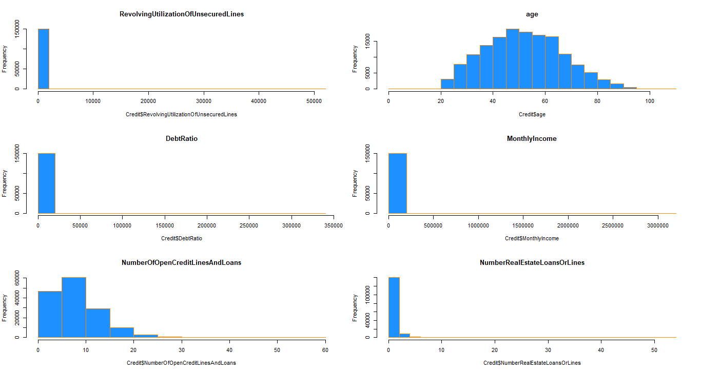
  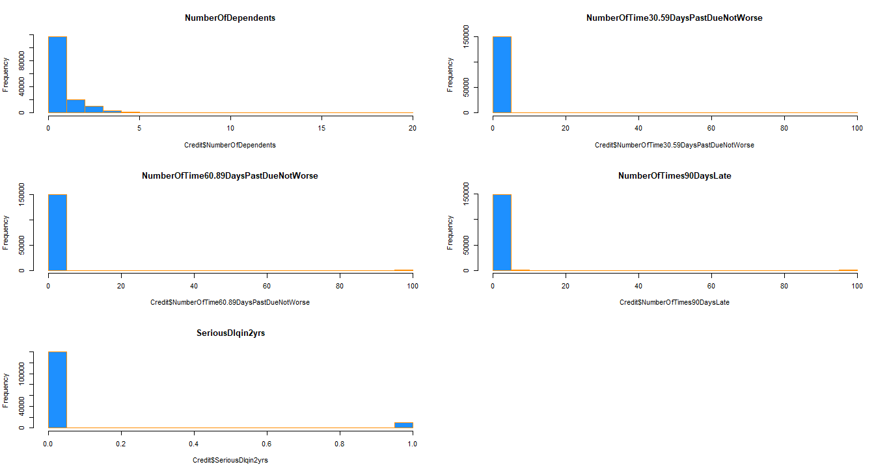
</div>

We find there are considerable outliers and most of the features are slightly positively skewed

<div class="flexible-container">
  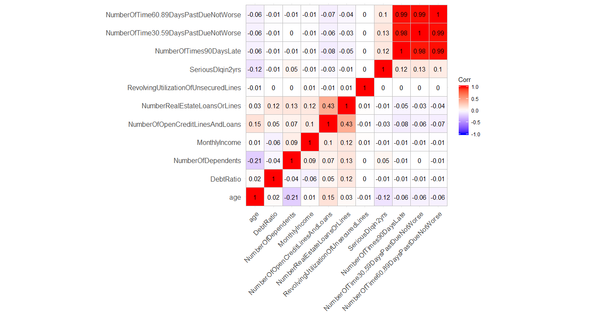
</div>

Besides, there are 3 highly related features.

## (6) Feature Engineering

1. **RevolvingUtilizationOfUnsecuredLines**：Converting values > 1.2 into 1.2, yielding new feature "BaLim_ratio".
2. **age**：Converting an outlier at age = 0 into the closest value 20, yielding new feature "age_2".
3. **MonthlyIncome**：Converting values > 23300 into 23300, adding 10 to all values, then taking log(), yielding new feature "Income_log". Next, creating a new feature "Income_bool", with two categories MonthlyIncome = 0 and MonthlyIncome =/= 0. We figure that those with 0 monthly income might be students or housewives, and they may display different charateristics from the others.
4. **NumberOfDependents**： Converting values > 2 into 2, yielding new feature "Dep".
5. **DebtRatio**：Converting values > 1200 into 6, Converting 1200 > values > 6 into 5, yielding new feature "D_Ratio".  
6. **NumberOfOpenCreditLinesAndLoans**：All values +1, then taking log(), yielding new feature "OCLAL". 
7. **NumberRealEstateLoansOrLines**：Converting values > 5 into 5, yielding new feature "REOL".
8. **NumberOfTime30.59DaysPastDueNotWorse**：Converting values > 3 into 3, yielding new feature "Num_30.59". 
9. **NumberOfTime60.89DaysPastDueNotWorse**：Converting values > 2 into 2, yielding new feature "Num_60.89".  
10. **NumberOfTimes90DaysLate**：Converting values > 2 into 2, yielding new feature "Num_90".


## (7) EDA after Feature Engineering

<div class="flexible-container">
  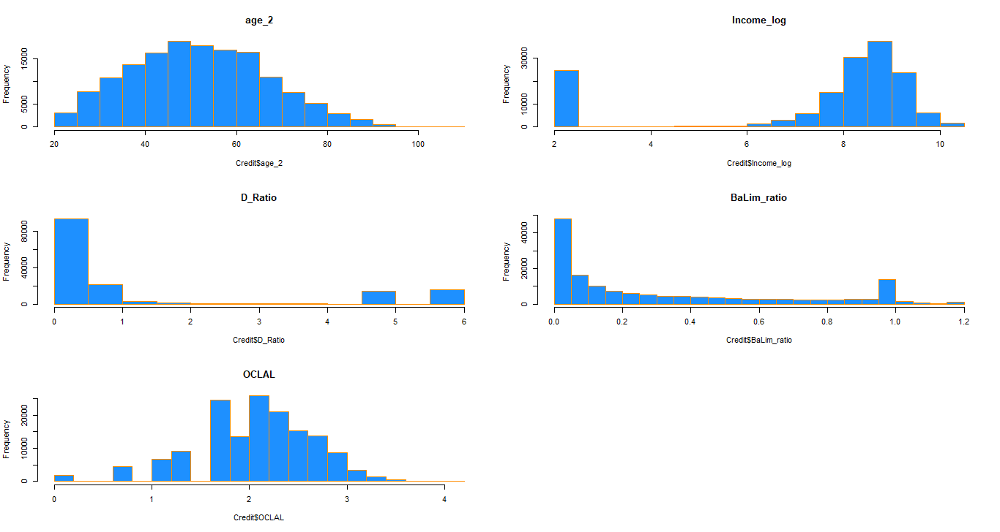
</div>

<div class="flexible-container">
  
</div>

After handling the considerable outliers and taking log(), the features now are more like normal distributions. 

<div class="flexible-container">
  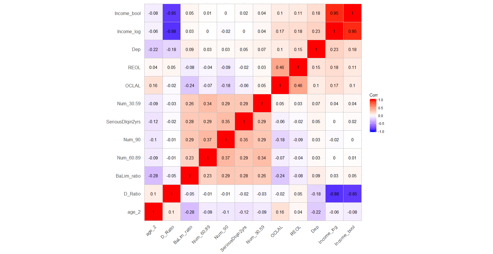
</div>

The cells with high correlations lessen. The significant relation between *"Income_log"* & *"Income_bool"* would bother since we would find *"Income_bool"* does raise the prediction performance. 


## (8) Model Building, Feature Selection & Outcomes: LR, RF & XGBoost with Stacking 

### 8-1 Models & Model Evaluation
We adopt 3 methods as follows:
1. Logistic Regression
2. Random Forest)
3. XGBoosT 

Since it's a imbalanced data, the required metric is AUC. 


### 8-2 Logistic Regression

```R
model <- glm(formula = SeriousDlqin2yrs ~ age_2 + Income_log + I(Income_log^2) + 
               I(Income_log^3) + D_Ratio + I(D_Ratio^2) + I(D_Ratio^3) + Income_bool +
               BaLim_ratio + OCLAL + I(OCLAL^2) + Dep + REOL + Num_30.59 + 
               Num_60.89 + Num_90 + Num_30.59:Num_90 + Num_30.59:Num_60.89 + 
               age_2:Num_90 + Num_60.89:Num_90 + age_2:Num_60.89 + D_Ratio:BaLim_ratio + 
               REOL:Num_90 + age_2:Num_30.59 + age_2:Dep + age_2:D_Ratio + 
               REOL:Num_60.89 + Income_log:Num_30.59 + age_2:REOL + Income_log:REOL, 
             family = binomial(link = "logit"), data = Credit_train)

summary(model)
AIC(model); BIC(model)
```
Generating higher-degree terms as well as interactions, then leveraging stepwise logistic regression (both directions) to choose the influential features. Afterwards, choosing features based on AIC, BIC and the p-values of the features.


### 8-3 Treelike Methods – Tuning

Sampling 10,000 data points out of total 150,000 training data points to speed up tuning. 


### 8-4 Treelike Methods – Result

Utilize the tuning results on the whole training dataset with 15,000 data points. 


### 8-5 Stacking

Adopting two-layer stacking. First, get the stacking of LR, RF & XGBoost models using mean respectively. Next, put several LR_stacking, RF_stacking & XGBT_stacking together and do another stacking using mean. Then, we obtain the final AUC results.


### 8-6 Submissions on Kaggle

*"Private Score"* on the left, and *"Public Score"* on the right.

#### 8-6-1 LR
<div class="flexible-container">
  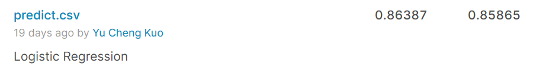
</div>

#### 8-6-2 RF
<div class="flexible-container">
  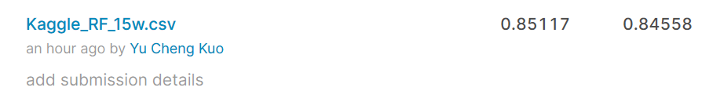
</div>

#### 8-6-3 XGBoost
<div class="flexible-container">
  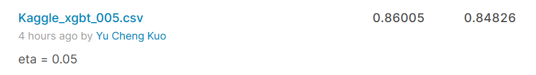
</div>

From the fact that XGBoost outperforms RF, we conclude that the noise of this dataset is negligible. Confirming the noise exist or not could result in completely different implications for tuning.  

#### 8-6-4 Stacking
<div class="flexible-container">
  
</div>

#### 8-6-5 Stacking02
<div class="flexible-container">
  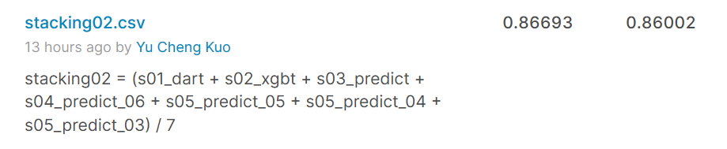
</div>

#### 8-6-6 Stacking03
<div class="flexible-container">
  
</div>

#### 8-6-7 Stacking04
<div class="flexible-container">
  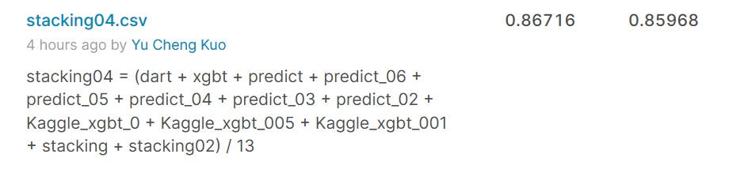
</div>

#### 8-6-8 Stacking05
<div class="flexible-container">
  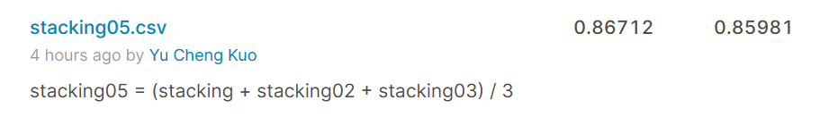
</div>

#### 8-6-9 Stacking06
<div class="flexible-container">
  
</div>

#### 8-6-10 Stacking07
<div class="flexible-container">
  
</div>

#### 8-6-11 Stacking08
<div class="flexible-container">
  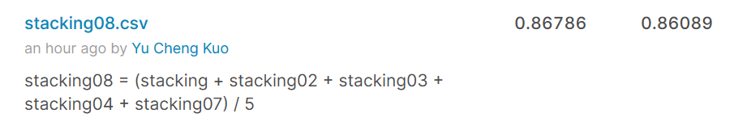
</div>

#### 8-6-12 The Best Outcomes
<div class="flexible-container">
  
</div>

#### 8-6-13 Public Score Leaderboard
<div class="flexible-container">
  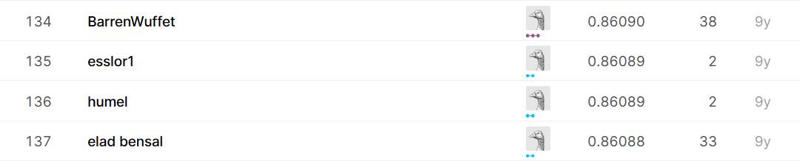
</div>

#### 8-6-14 Private Score Leaderboard (Final Ranking)
<div class="flexible-container">
  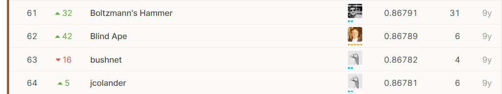
</div>

- After thorough feature engineering, I leveraged LR, RF & XGBoost, then did a double-layer stacking. Finally, I got 14.83% (17/924) on public leaderboard and 6.82% (63/924) on private leaderboard, which is equivalent to getting a bronze medal in this long closed competition.

## (9) Conclusion 

- We choose the best public score one with 14.83% (137/924) on public leaderboard, which correspond to achieving 6.82% (63/924) on private leaderboard, which is equivalent to getting a bronze medal in this long closed competition.

- We may add interactions in to RF & XGBoost models for better performance.


## (10) References
1. Ozdemir, S., Susarla, D. (2018). Feature Engineering Made Easy.
2. Zheng, A., Casari A. (2018). Feature Engineering for Machine Learning.
3. Bonaccorso, G. (2017).  Machine Learning Algorithms (2nd ed.). Birmingham, UK: Packt Publishing.
4. Battiti, R., Brunato, M. (2017). Learning plus Intelligent Optimization Paperback. Trento, Italy: LIONlab, University of Trento.
5. Zumel, N., Mount, J. (2014) Practical Data Science with R.
6. Online forum of the dataset “Give Me Some Credit”(2011) on Kaggle. Retrieved from https://bit.ly/3eWviGl
